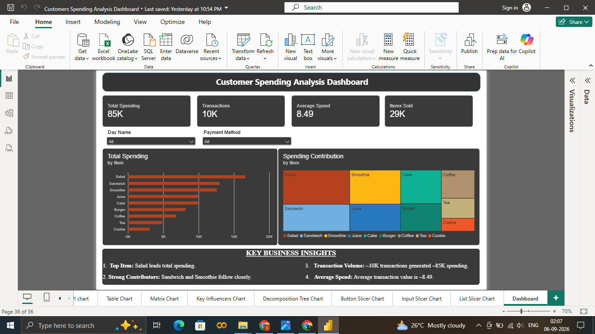

# Customer Spending Analysis Dashboard – Power BI

## Project Overview

This project is an interactive Customer Spending Analysis Dashboard developed using Microsoft Power BI.

The dashboard analyzes customer transaction data to understand spending patterns, transaction volume, item-wise spending, and customer purchasing behavior.

The project includes data cleaning and transformation using Power Query, data modeling in Power BI, and interactive visualizations to present meaningful business insights.

---

## Tools & Technologies

- Microsoft Power BI
- Power Query
- DAX
- Excel
- Data Visualization
- Data Cleaning & Transformation
- Data Modeling

---

## Dataset

The project uses a cafe customer transaction dataset containing transaction-level sales information.

The main dataset used in the dashboard is `Cafe_sales`.

### Dataset Fields

| Column | Description |
|---|---|
| Transaction ID | Unique transaction identifier |
| Item | Purchased item |
| Quantity | Number of items purchased |
| Price Per Unit | Price of one unit |
| Total Spent | Total transaction spending |
| Payment Method | Payment method used |
| Location | Transaction location |
| Transaction Date | Date of transaction |
| Month Name | Month derived from transaction date |
| Day Name | Day derived from transaction date |
| Week of Month | Week number within the month |
| Quarter | Quarter derived from transaction date |

---

## Data Cleaning & Transformation

The dataset contained missing, unknown, and error values.

Power Query was used to prepare the data before visualization.

### Key Data Preparation Steps

- Replaced missing item values.
- Replaced `UNKNOWN` and `ERROR` values.
- Handled missing payment methods.
- Handled missing location values.
- Replaced invalid quantity values.
- Replaced invalid price values.
- Replaced invalid total spending values.
- Corrected transaction date values.
- Converted numeric columns to appropriate data types.
- Converted transaction date into a proper date format.
- Created Month Name.
- Created Day Name.
- Created Week of Month.
- Created Quarter.

---

## Dashboard Features

The main dashboard provides an interactive view of customer spending behavior.

### KPI Cards

The dashboard includes:

- **Total Spending**
- **Transactions**
- **Average Spend**
- **Items Sold**

These KPIs provide a quick overview of overall customer activity and spending.

### Interactive Filters

Users can filter the dashboard using:

- **Day Name**
- **Payment Method**

The filters interact with the dashboard visuals to provide a more focused analysis.

### Visualizations

The dashboard includes:

- Total Spending by Item – Bar Chart
- Spending Contribution – Treemap
- KPI Cards
- Interactive Slicers
- Key Business Insights section

---

## Key Business Insights

The dashboard highlights the following insights:

- **Salad** is the leading item based on total spending.
- Approximately **10K transactions** generated around **85K in total spending**.
- The dashboard provides visibility into **average customer spending**.
- Item-wise spending comparison helps identify high-performing products.
- Payment method filtering allows spending behavior to be analyzed across different payment methods.
- Day-wise filtering helps identify changes in spending patterns across different days.

---

## Dashboard Screenshots

### Customer Spending Analysis Dashboard



---

## Project Structure

```text
...
Customer-Spending-PowerBI/
│
├── README.md
│
├── Customers Spending Analysis Dashboard.pbip
│
├── Customers Spending Analysis Dashboard.Report/
│
├── Customers Spending Analysis Dashboard.SemanticModel/
│
└── screenshots/
    └── customer_spending_dashboard.png
```

## Power BI Project Structure

The Power BI project is maintained in PBIP format and contains separate report and semantic model definitions.

### Report

The report definition contains:

- Dashboard page
- Visual configurations
- KPI cards
- Bar chart
- Treemap
- Slicers
- Key Business Insights
- Report formatting and layout

### Semantic Model

The semantic model contains:

- `Cafe_sales`
- KPI-related tables
- Date tables
- Data model definitions
- Relationships
- Power Query transformations

---

## Business Value

This dashboard demonstrates how raw transaction data can be transformed into an interactive business intelligence solution.

The analysis helps users:

- Monitor overall customer spending
- Identify high-spending products
- Understand transaction volume
- Compare spending across items
- Analyze payment-method behavior
- Explore day-wise spending patterns
- Support data-driven business decisions

---

## Conclusion

This project demonstrates practical Power BI and Data Analyst skills by transforming raw customer transaction data into an interactive spending analysis dashboard.

The project covers data cleaning, transformation, data modeling, KPI creation, interactive filtering, and business-focused visualization.

It demonstrates how Power BI can be used to convert transaction-level data into clear and actionable business insights.